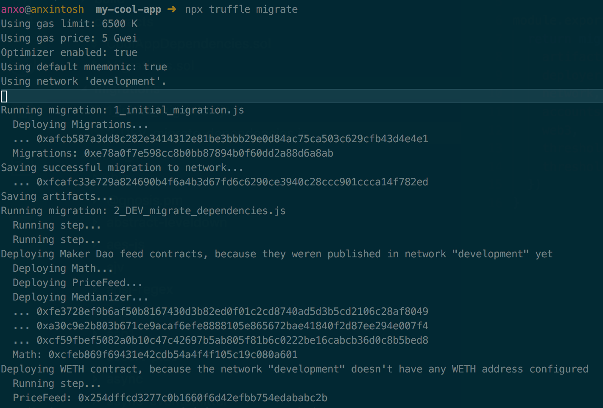
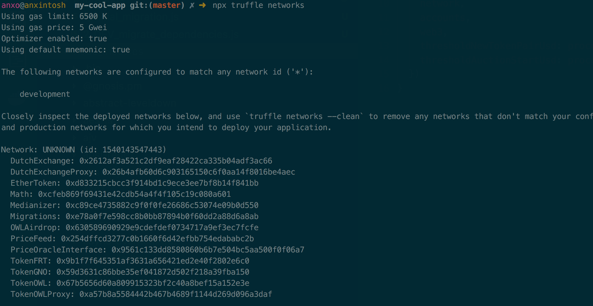
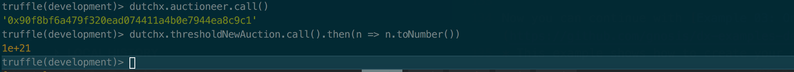

# Truffle Migrate
This project is an example that shows how to create a new project from scratch 
that depends on DutchX and how you can deploy the DutchX contracts in a 
`ganache-cli` local node.

It shows how to deploy easily the contracts in a local ganache-cli,
so we don't depend on testnets like Rinkeby and we can speed up the development.

Also, using truffle brings many other advantages like test, migrations, 
easier interaction, sharing compiled contracts into NPM packages, etc...

> For more info on truffle see:
> * https://truffleframework.com

> This example is part of the guide http://dutchx.readthedocs.io/en/latest/
>
> You can find other examples in the [Build on top of DutchX project](https://github.com/gnosis/dx-examples-dev)

# Have you done the first example?
Maybe you should consider doing the 
[basic web example first](https://github.com/gnosis/dx-examples-dev/tree/master/01_basic-web-deposit).

That example doesn't use truffle, and it shows the basics on how to integrate
with DutchX.

## Create a basic truffle contract
Create your `my-cool-app` project:
```bash
mkdir my-cool-app
cd my-cool-app
npm init
```

Make it a Truffle 5 project:
```bash
mkdir contracts migrations
npm install --save-dev truffle@^5.0.0-beta.2 truffle-hdwallet-provider@^1.0.0-web3one.1 truffle-contract
```

> If you prefer to stick to Truffle 4 for now, you can, you can alter slight the 
> steps to adapt it to this version. 
>
> It just change thes small changes from the original guide:
> * *Dependencies*: `npm install --save-dev truffle truffle-hdwallet-provider truffle-contract`
> * *truffle.js*: When configuring the project, use this 
  [truffle4.js](./truffle4.js) as your truffle config.
> * *DutchX migration script*: Use the ones in the dir `[migrations-truffle-4](./migrations-truffle-4)`
> * *Example contracts*: Use the ones in the dir `[contracts-truffle-4](./contracts-truffle-4)`


## Add a truffle config
Add [truffle.js](./truffle.js) into the root of the project. 

This truffle config file, has a pretty standard boilerplate config with:
  * **Networks**: Define networks: ganache-cli (development), rinkeby, kovan and mainnet.
  * **Mnemonic**: Configured with a default test mnemonic. It allows to change
    it by providing the `MNEMONIC` environment variable.
      * Default Mnemonic: `candy maple cake sugar pudding cream honey rich smooth crumble sweet treat`
      * Default address: `0x627306090abab3a6e1400e9345bc60c78a8bef57`
      * `IMPORTANT`: Don't use this mnemonic for mainnet with real funds. This
        is a public test mnemonic used in many projects.
  * **Gas price**: Configured with a default gas price. It allows
    to change it by providing the `GAS_PRICE_GWEI` environment variable.
      * Default Gas Price: `5 Gwei`
  * It prints useful information

## Add the first migration and it's contract
Just copy the `Migrations` contract and it's migration (this is pretty common
on all truffle projects):
* [contracts/Migrations.sol](./contracts/Migrations.sol) into `contracts` dir
* [migrations/1_initial_migration.js](./migrations/1_initial_migration.js) into `migrations` dir

## Add DutchX as a NPM dependency
```bash
npm install @gnosis.pm/dx-contracts --save-dev
```

## Make sure truffle finds the dependencies
Copy the code from:
* [contracts/CoolAppDependencies.sol](./contracts/CoolAppDependencies.sol).

With this new contract, we ensure that for local development, truffle finds all 
DutchX contract.

This contract won't do anything, it won't event have code, the important thing
is that it must import `@gnosis.pm/dx-contracts/contracts/DxDevDependencies.sol`
so truffle will pull and compile all the required contracts.

> For more information, check:
>   * https://github.com/gnosis/dx-contracts/blob/master/contracts/DxDevDependencies.sol

## Compile DutchX contracts
Compile the contracts.

```bash
npx truffle compile
```

We'll see how the `DutchExchange` is being compiled among all the other 
contracts it depends on:

We should see something very similar to:


## Migrate the DutchX to local-ganache
Copy this file into your project:
* [migrations/2_DEV_migrate_dependencies.js](./migrations/2_DEV_migrate_dependencies.js)

This truffle migration:
* Only executes in the `development` network (Note that `rinkeby` and `mainet` 
contracts are already deployed).
* Uses the contracts that are in our NPM dependencies, so we avoid repetition.
* Uses the migration scripts that are in our NPM dependencies. **DutchX** NPM 
module provides a simple migration source that can be referenced to ease the 
local development.

> For more information, check:
>   * https://github.com/gnosis/dx-contracts/blob/master/src/migrations/index.js

## Apply the migrations
```bash
# Run a ganache cli
npx ganache-cli -d

# Run migrations
#   It's also a good idea to add it a a package.json script
npx truffle migrate
```

Truffle will migrate automatically all contracts:



## Truffle console
If we execute `npx truffle networks` at this point, we can verify the addresses
of the contracts deployed to the local ganache-cli.



If we run `truffle console`, we'll be able to play arround with the deployed 
DutchX smart contracts.

```bash
truffle console

truffle(development)> dutchx = DutchExchange.at(DutchExchangeProxy.address)
truffle(development)> dutchx.auctioneer.call()
truffle(development)> dutchx.thresholdNewAuction.call().then(n => n.toNumber())
```



## Next steps
Congratulations! you now have a truffle project that deploys all the DutchX contracts as 
part of it's first migration.

Now you can continue with [Example 03: Onchain integration - Use it as an oracle](https://github.com/gnosis/dx-examples-dev/tree/master/03_onchain-integration-oracle): 
* This example shows how to create your own contract and migrations that makes 
use of the DutchX.
* In this example we will create a `Safe` contract to deposit fund. We will
use the DutchX to help us estimate the price in `USD` for any token in our 
`Safe`.
